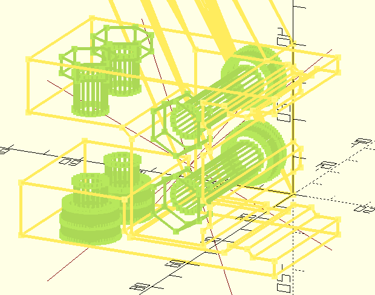
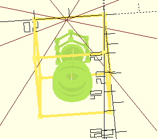
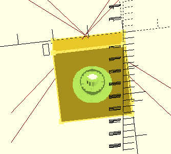

=================
Openscad Projects
=================

Intro
=====

Various designs, modification and libraries I keep in a singe repositories to make imports in OpenScad a little easier.

See subdirectories for more information on each project. I post completed models to prusaprinters and thingiverse.

hardware-recess
===============

**libs/hardware-recess.scad** is a library of making holes shaped like various metric bolts and nuts as well as 2020 aluminium profile.

Currently define metric harware values

.. code-block:: openscad

    // List defined hardware
    M3 = 3;
    M4 = 4;
    M5 = 5;
    M8 = 8;
    // Dimensional info for metric capscrew hardware
    //             [0,      1,            2,     3,          4,     5        ]
    // List values [bolt_d, bolt_head_d, bolt_h, nut_trap_d, nut_h, locknut_h]
    M_DIM = [
        [], // spacing
        [], // M1
        [], // M2
        [3.2, 5.6, 3.2, 6.7, 2.4, 3], // M3
        [4.1, 7.1, 4.05, 9.0, 3.9, 4], // M4
        [5.2, 8.6, 4.90, 9.7, 4, 5],  // M5
        [], // M6
        [], // M7
        [8.1, 13.1, 7.98, 14.6, 6.3, 8] // M8
    ];

An example of making a recess cut for 20mm bolt and nut where 20mm includes capscrew length.

.. code-block:: openscad

    include <../libs/hardware-recess.scad>;

    difference(){
        cube([20, 20, 20]);
        translate([10,10, 0]) bolt_nut(20, M5);
    }

